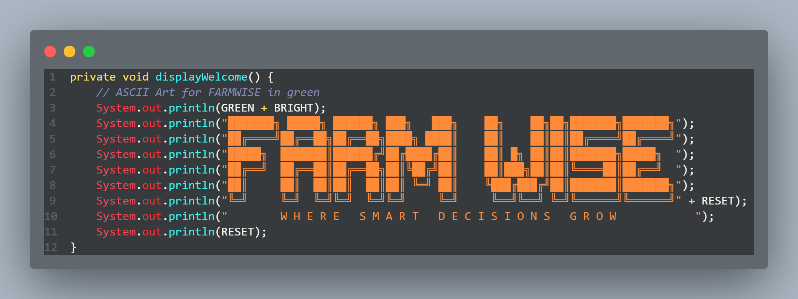
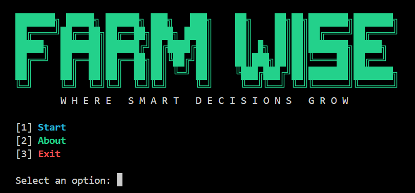
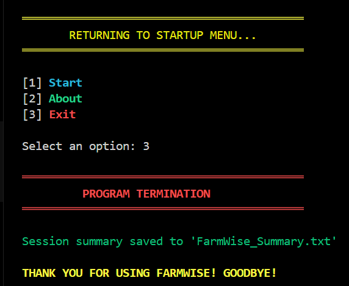
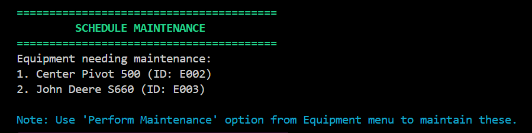
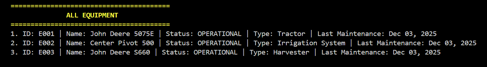

# 🚜 FarmWise - Smart Farm Task and Equipment Management System

## 📋 Description/Overview
FarmWise is a comprehensive farm management system designed to streamline equipment maintenance and task scheduling operations. The system solves the problem of disorganized farm management by providing a centralized platform to track equipment status, schedule maintenance, manage tasks, and generate reports. Key features include equipment maintenance tracking, task management with priority levels, automated report generation, and session summaries.

## 🎯 OOP Concepts Applied

### 🔒 Encapsulation
All classes implement encapsulation by using private fields with public getter and setter methods:
- `FarmClass` encapsulates `farmId` and `farmName` with protected access
- `Equipment` encapsulates equipment-specific fields (`eqType`, `eqLastMaintenance`, `eqNeedsMaintenance`)
- `Tasks` encapsulates task-related fields (`dueDate`, `completionDate`, `prio`, `assignedEq`, `isCompleted`)
- `Receipt` encapsulates file handling functionality with private `dateFormat`

### 👨‍👩‍👧‍👦 Inheritance
The project demonstrates inheritance through a clear class hierarchy:
- `FarmClass` serves as an abstract base class
- `Equipment` extends `FarmClass`, inheriting common farm item properties
- `Tasks` extends `FarmClass`, inheriting the base identifier and name properties
- Both subclasses inherit the `toString()` method and implement the abstract `getStatus()` method

### 🔄 Polymorphism
Polymorphism is implemented through method overriding:
- Both `Equipment` and `Tasks` override the `getStatus()` method with specialized implementations
- Both subclasses override the `toString()` method to provide class-specific string representations
- The abstract `getStatus()` method in `FarmClass` enables polymorphic behavior

### 🎨 Abstraction
- `FarmClass` is declared as an abstract class, preventing direct instantiation
- The `getStatus()` method is abstract, forcing subclasses to provide specific implementations
- This abstraction allows for creating a common interface while hiding implementation details

## 🏗️ Program Structure

### 📁 Main Classes and Their Roles

- **FarmClass** (Abstract Base Class)
  - Provides common attributes and methods for all farm items
  - Defines the abstract `getStatus()` method contract
  - Implements common toString() functionality

- **Equipment** (Concrete Class)
  - Manages farm equipment with maintenance tracking
  - Handles maintenance scheduling and status updates
  - Extends FarmClass with equipment-specific properties

- **Tasks** (Concrete Class) 
  - Manages farm tasks with due dates and priorities
  - Tracks task completion and equipment assignment
  - Extends FarmClass with task-specific functionality

- **FarmWise** (Main Application Class)
  - Orchestrates the entire system through a menu-driven interface
  - Manages collections of equipment and tasks
  - Provides user interaction and system coordination

- **Receipt** (Utility Class)
  - Handles file output operations for receipts and summaries
  - Generates task completion receipts and session reports

 
### 📸 Snaps






## 🚀 How to Run the Program

### 📋 Prerequisites
- **Java Development Kit (JDK) 17 or higher** installed
- **Command line/terminal** access
- **Git** (optional, for cloning the repository)

### 📥 Getting Started

#### Option 1: Clone Repository (Recommended)
```bash
# Clone the repository to your local machine
git clone https://github.com/yourusername/farmwise.git

# Navigate to the project directory
cd farmwise

```

#### Option 2: Download Project Files
1. Download all Java files from the repository
2. Place them in a single directory (e.g., FarmWiseProject/)
3. Open terminal in that directory

### ⚙️ Compilation Instructions
```bash
# Compile all Java files in the current directory
javac *.java
```

### ▶️ Running the Application
```bash
# Run the main class
java FarmWise
```

#### Future Enhancements
To further strengthen the FarmWise system and expand its functionality, the researchers recommend implementing the following enhancements in future development cycles:
- Graphical User Interface (GUI)
  > A dedicated GUI should be developed to replace the current console-based interface. Implementing a JavaFX or web-based interface would greatly improve usability by providing intuitive navigation, visual dashboards, and easier interaction for users who may not be familiar with command-line systems.
- Cloud Synchronization
  > Integrating cloud-based data storage is recommended to allow FarmWise to operate across multiple devices and locations. Cloud synchronization would enable real-time updates, support multi-user access, and ensure that farm data is securely backed up and accessible anytime.
- Advanced Reporting and Analytics
  > The system can be enhanced by introducing automated and visual reporting tools. This includes generating charts, summaries, and performance metrics related to equipment and tasks. Advanced analytics will help farm managers make informed decisions and monitor trends more effectively.
- Database Integration
  > Replacing the project’s current file-based storage system with a robust database solution—either SQL or NoSQL—is highly recommended. This would improve data reliability, enable faster data retrieval, support larger datasets, and ensure long-term scalability as the system grows.

### References
Shinde, S., Koleshwar, P., Deore, A., Dabhilkar, S., & Dalvi, D. (2025). FarmWise: Your Smart Farming Companion. International Journal of Computer Techniques, 12(5). https://ijctjournal.org/wp-content/uploads/2025/10/FarmWise-Your-Smart-Farming-Companion.pdf

Vanjari, N., Ghadage, M., Wadekar, S., Tagare, D., & Shelke, S. (2025, January 25). AgroCare: AI-Powered Crop Management System. 2nd Insight International Research Conference (IIRC-2025). SSRN. https://ssrn.com/abstract=5251333 

<div align="center">

🚜 Happy Farming with FarmWise! 🌱

</div>
